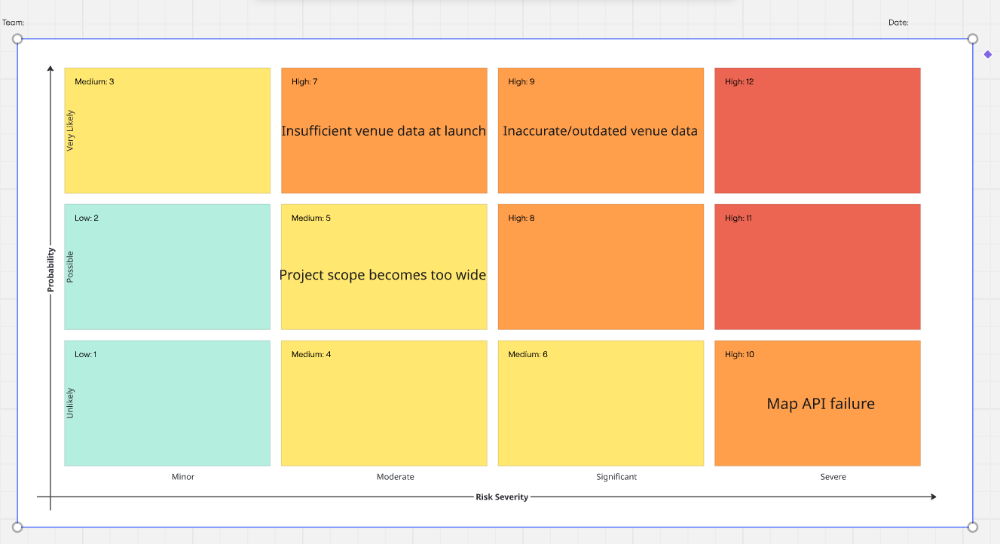
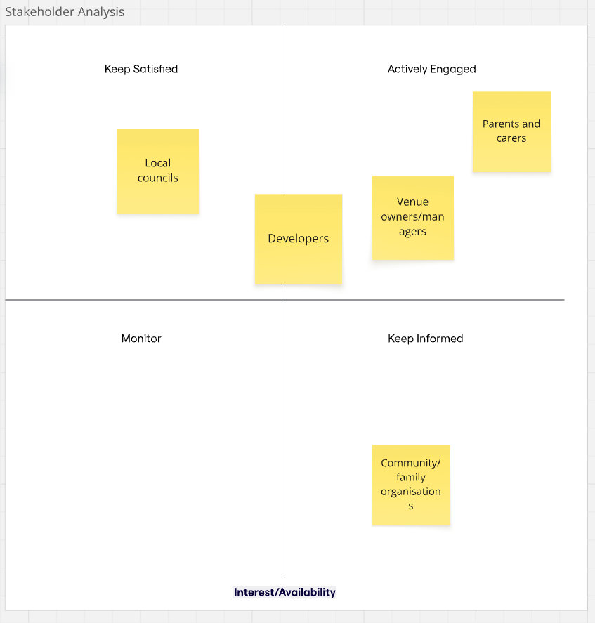

# Baby & Me

## Problem statement

Solo Parenting often comes with the struggle to find suitable places to visit with their children because essential information—such as baby-changing facilities, pushchair access, parking, affordability and age suitability is scattered, unclear or unavailable. Existing platforms may describe venues as “family-friendly,” but rarely show how manageable they are for one adult caring for children alone.

## Solution

Our solution for this problem is to build a platform that helps parents
discover and confidently plan family-friendly outings, The platform will provide recommendations for venues and activities,
along with detailed parent focused information such as baby-changing facilities, pushchair access, parking options, affordability
and age suitability. Our uniqueness is our particular focus of the challenges of solo parenting. Parents can view real reviews and rating from other
families giving a greater understanding on the manageability of a location when caring for a child independently.

Not only is our platform for recommendations but it also aims to create a supportive community where parents can connect,
share advice and overall support one another with just everyday parenting challenges.
And by combining all of these aspects we aim to reduce the stresses of planning outings and help families feel confident exploring new places together.

## User Profiles

Single parents - Main target
Parents -
Disabled people -
Bereaved people -

### User stories

As a single parent, I want to check whether a venue has baby-changing facilities, accessible toilets, pushchair access and nearby parking, so that I can feel prepared before visiting.

As a single parent, I want to search for family-friendly places near me, so that I can quickly plan an enjoyable day out with my children.

As a single parent, I want to read reviews from other solo parents, so that I can understand how manageable and suitable a venue is when visiting without another adult.

As a parent, I want to be able to contribute by sharing my own experience of a particular place, so that other parents can see how my experience really was.

As a parent, I want to be able to filter by my child age range, so that i can find places that are suitable for them

As a parent, I want to connect with other local parents through the platform, so that I can build a support network and arrange shared activities.

As a parent, I want to see live information about venue opening hours and availability, so that I can avoid wasted journeys.

As a parent, I want to create and share lists of recommended places, so that other families can benefit from my experiences.

As a parent, I want to be able to report inaccurate or outdated information about a venue, so that the platform remains trustworthy and reliable

As a venue owner, I want to add and update details about my venue — age suitability and facilities — so that parents can see how child-friendly it is and choose to visit with confidence.

As a user I want to access a working interface so that I can see a map of accessible locations

## Risk/stakeholder analysis diagram

- Insufficient venue data at launch: Without enough venue information, users may struggle to find useful results which will effect the quality of the app.

- Inaccurate/outdated venue data: Facilities can change over time, meaning users could make plans based on incorrect accessibility information.

- Project scope becomes too wide: The two week timeframe and feature freeze means trying to work on too many features could prevent the main MVP from being completed.

- Map API failure: The map is essential to finding venues, so an integration issue could significantly affect the application's core functionality.

- Parents & carers: They are the primary users, so their needs and feedback directly influence whether the app is useful.

- Venue owners/managers They can provide and verify information about their facilities and their level of accessibility can attract business.

- Developers: They have significant influence because they design and build the solution but they don't really use the product.

- Local councils: They may have influence over local accessibility initiatives and venue information but aren't directly involved in everyday use of the app.

- Community/family organisations: They have a strong interest in improving services for families and could help promote the platform, but have limited direct influence over its development.

## USP

Our product offers a comprehensive, filterable map that shows users all facilities that are suitable for their individual needs.

## MVP Reqs

A functioning mobile based application that has a map view where users can search for specific facilities near them. Each facility should have a list of amenities and a rating to allow users to gauge how suitable it is for them to travel there.

It will have the capability to allow users to leave and read reviews and update available amenities provided by locations.

It will allow users to filter the map search to only include places with given amenities.

The MVP will include:

- A Mobile based frontend application
- A database storing Users, Locations (Amenities and ratings), ?Frequently used maps?
- Backend API that will be deployed and accessible to the frontend

#### Trello

## Wireframes

## Stretch Goals
- AI implementation - We would use a chatbot to help plan itineraries based on input from the user and results from the api. Culminate that into a structured output.
- Car service - so you don't have to leave your car with young child inside

## Technologies
