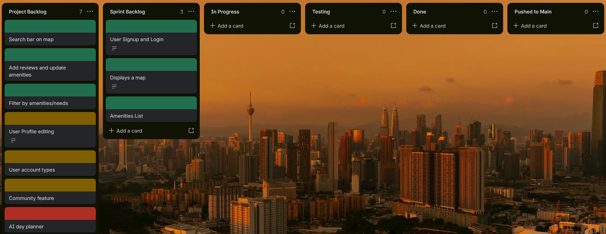

# Appcessable Maps

## Problem statement

Single parents often struggle to find suitable places to visit with their children because essential information—such as baby-changing facilities, pushchair access, parking, affordability and age suitability—is scattered, unclear or unavailable. Existing platforms may describe venues as “family-friendly,” but rarely show how manageable they are for one adult caring for children alone. This makes planning outings stressful and time-consuming and can discourage single-parent families from exploring new places.

## Solution

## User Profiles

Single parent - Main target

Disabled people - 

Bereaved people - 

Parent - 

### User stories

As a single parent, I want to check whether a venue has baby-changing facilities, accessible toilets, pushchair access and nearby parking, so that I can feel prepared before visiting.

As a single parent, I want to search for family-friendly places near me, so that I can quickly plan an enjoyable day out with my children.

As a single parent, I want to read reviews from other solo parents, so that I can understand how manageable and suitable a venue is when visiting without another adult.

As a parent, I want to be able to contribute by sharing my own experience of a particular place, so that other parents can see how my experience really was.

As a venue owner, I want to add and update details about my venue — age suitability and facilities — so that parents can see how child-friendly it is and choose to visit with confidence.

As a wheelchair user, I want to see if a venue is fully accessible to me, so that I can plan my trips in advance.

As a user I want to access a working interface so that I can see a map of accessible locations

## Risk

## USP

Our product offers a comprehensive, filterable map that shows users all facilites that are suitable for their individual needs.

## MVP Reqs

A functioning mobile based application that has a map view where users can search for specific facilities near them. Each facility should have a list of amenities and a rating to allow users to gauge how suitable it is for them to travel there. 

It will have the capability to allow users to leave and read reviews and update available amenities provided by locations.

It will allow users to filter the map search to only include places with given amenities.

The MVP will include:

- A Mobile based frontend application
- A database storing Users, Locations (Amenities and ratings), ?Frequently used maps?
- Backend API that will be deployed and accessible to the frontend

#### Trello

## Wireframes

## Stretch Goals

- AI (LLM) for day out planning
- Community feature

## Technologies

